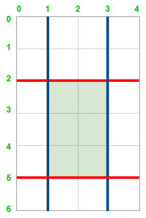

## Problem
Maximum area of a Cake after Horizontal and Vertical cuts

Given two positive integers h and w representing the height and width of a rectangle. Additionally, we have two arrays, horizontalCuts and verticalCuts, where:

    (i) horizontalCuts[i] is the distance from the top of the rectangular cake to the i-th horizontal cut.
    (ii) verticalCuts[i] is the distance from the left of the rectangular cake to the j-th vertical cut.
    
The task is to find the maximum area of the rectangle after you cut at each horizontal and vertical position provided in the arrays horizontalCuts and verticalCuts.

### Examples: 
```
Input: h = 6, w = 4, horizontalCuts = [2, 5], verticalCuts = [1, 3]
Output: 6
Explanation: The figure below represents the given rectangle.
```

```
Red lines are the horizontal cuts and blue lines are vertical cuts. After the rectangle is cut, the green piece of rectangle has the maximum area.

Input: h = 5, w = 4, horizontalCuts = [3, 1], verticalCuts = [1]
Output: 9
```

### [Expected Approach] Using Sorting - O(n * log(n) + m * log(m)) Time and O(1) Space
```
The idea is to maximize the area of a rectangular piece formed by the cuts. Since the largest area is determined by the widest horizontal and vertical gaps, we first sort the cut positions and find the maximum gaps between consecutive cuts. The final area is obtained by multiplying the largest horizontal gap with the largest vertical gap. Sorting ensures efficient gap calculation, making the approach optimal.
```
Steps to implement the above idea:

    (i)   Sort horizontalCuts and verticalCuts in ascending order to process them efficiently.

    (ii)  Append h and w to their respective lists to ensure the last segment is considered.

    (iii) Initialize maxHorizontal and maxVertical with the first cut size to handle the first segment.

    (iv)  Iterate through horizontalCuts and verticalCuts to find the maximum gap between           consecutive cuts.

    (v)   Multiply the largest horizontal gap with the largest vertical gap to get the maximum area.

    (vi)  Return the computed maximum area, which represents the largest rectangular piece after the cuts.

```java title="Java"
import java.util.*;
public class Solution {
    public static int maxArea(int h, int w, List<Integer> horizontalCuts, List<Integer> verticalCuts) {
        Collections.sort(horizontalCuts);
        Collections.sort(verticalCuts);

        // Insert the right bound h and w
        // in their respective lists
        horizontalCuts.add(h);
        verticalCuts.add(w);

        int maxHorizontal = horizontalCuts.get(0);
        int maxVertical = verticalCuts.get(0);


        //Find maximum horizontal length possible
        for (int i = 1; i < horizontalCuts.size(); i++) {
            maxHorizontal = Math.max(maxHorizontal, horizontalCuts.get(i) - horizontalCuts.get(i - 1));
        }
        //Find maximum vertical length possible
        for (int i = 1; i < verticalCuts.size(); i++) {
            maxVertical = Math.max(maxVertical, verticalCuts.get(i) - verticalCuts.get(i - 1)); 
        }

        // Return the maximum area of rectangle
        return maxHorizontal * maxVertical; 
    }
}
```
#### Output
```
6
```   

