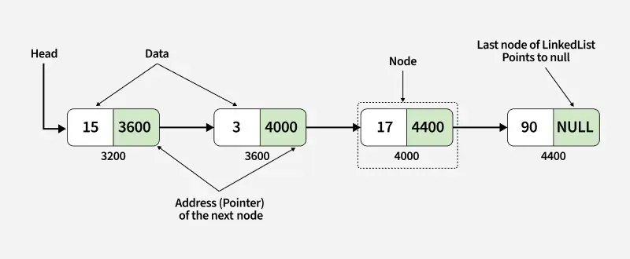
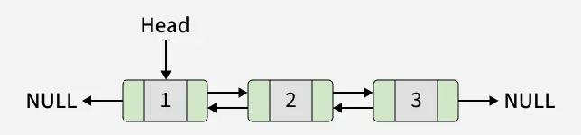
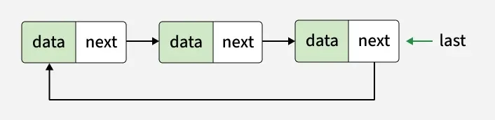
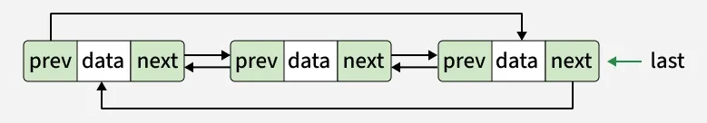

**Topic landing page** example (`docs/linkedlist/README.md`):
<!-- ```md
---
sidebar_position: 1
--- -->


# Linked List Data Structure
A linked list is a fundamental data structure in computer science. It mainly allows efficient insertion and deletion operations compared to arrays. Like arrays, it is also used to implement other data structures like stack, queue and deque.Here’s the comparison of Linked List vs Arrays



## Linked List:
1) Data Structure: Non-contiguous
2) Memory Allocation: Typically allocated one by one to individual elements
3) Insertion/Deletion: Efficient
4) Access: Sequential

## Arrays:
1) Data Structure: Contiguous
2) Memory Allocation: Contiguous
3) Insertion/Deletion: Inefficient
4) Access: Random Access

## Singly Linked List Tutorial
A singly linked list is a fundamental data structure, it consists of nodes where each node contains a data field and a reference to the next node in the linked list. The next of the last node is null, indicating the end of the list. Linked Lists support efficient insertion and deletion operations.


### Understanding Node Structure
In a singly linked list, each node consists of two parts: data and a pointer to the next node. This structure allows nodes to be dynamically linked together, forming a chain-like sequence.

```java title="C++"
// Definition of a Node in a singly linked list
class Node {
  
public:
    // Data part of the node
    int data;

    // Pointer to the next node in the list
    Node* next;

    // Constructor to initialize the node with data
    Node(int data) {
        this->data = data;
        this->next = NULL;
    }
};
```
In this example, the Node class contains an integer data field (data) to store the information and a pointer to another Node (next) to establish the link to the next node in the list.

### Creating an Example Linked List of Size 3 to Understand Working
#### create the first node

Allocate memory for the second node and Store data in it.
Link the first node’s next to this new node.

#### Create the third node

Allocate memory for the third node and Store data in it.
Link the second node’s next to this node.
Set its next to NULL to ensure that the next of the last is NULL.

```java title="C++"
int main() {
    // Create the first node (head of the list)
    Node* head = new Node(10);

    // Link the second node
    head->next = new Node(20);

    // Link the third node
    head->next->next = new Node(30);

    // Link the fourth node
    head->next->next->next = new Node(40);
}
```
### Advantage
Dynamic size (no fixed limit like arrays)
Efficient insertion and deletion (especially in the middle)
Can implement complex data structures like stack, queue, graph

### Disadvantage
Extra memory required for storing pointers
No direct/random access (need traversal)
Cache unfriendly (not stored in contiguous memory)


## Doubly Linked List Tutorial
A doubly linked list is a more complex data structure than a singly linked list, but it offers several advantages. The main advantage of a doubly linked list is that it allows for efficient traversal of the list in both directions. This is because each node in the list contains a pointer to the previous node and a pointer to the next node. This allows for quick and easy insertion and deletion of nodes from the list, as well as efficient traversal of the list in both directions.



### Representation of Doubly Linked List in Data Structure
In a data structure, a doubly linked list is represented using nodes that have three fields:

1) Data

2) A pointer to the next node (next)

3) A pointer to the previous node (prev)


### Node Definition
Here is how a node in a Doubly Linked List is typically represented:
```java title="Java"
class Node {

    // To store the Value or data.
    int data;

    // Reference to the Previous Node
    Node prev;
  
    // Reference to the next Node
    Node next;
  
    // Constructor
    Node(int d) {
       data = d;
       prev = next = null;      
    }
};
```
```
Each node in a Doubly Linked List contains the data it holds, a pointer to the next node in the list, and a pointer to the previous node in the list. By linking these nodes together through the next and prev pointers, we can traverse the list in both directions (forward and backward), which is a key feature of a Doubly Linked List.

```

### Creating a Doubly Linked List with 4 Nodes
#### Create the head node.

Allocate a node and set head to it. Its prev and next should be null/None.
#### Create the next node and link it to head.

head.next = new Node(value2)
head.next.prev = head
Create further nodes the same way.

#### For the third node:
=> head.next.next = new Node(value3)
=> head.next.next.prev = head.next
Repeat until you have the required nodes.
Ensure the tail's next is null.

The last node you created must have next == null

Set / keep track of head (and optionally tail).
Use head to access the list from the front. Keeping a tail pointer simplifies appends.
```java title="Java"
class Node {
    int data;
    Node prev;
    Node next;

    Node(int value) {
        data = value;
        prev = null;
        next = null;
    }
}

class JJJ {
    public static void main(String[] args) {
        // Create the first node (head of the list)
        Node head = new Node(10);

        // Create and link the second node
        head.next = new Node(20);
        head.next.prev = head;

        // Create and link the third node
        head.next.next = new Node(30);
        head.next.next.prev = head.next;

        // Create and link the fourth node
        head.next.next.next = new Node(40);
        head.next.next.next.prev = head.next.next;

        // Traverse the list forward and print elements
        Node temp = head;
        while (temp != null) {
            System.out.print(temp.data);
            if (temp.next != null) {
                System.out.print(" <-> ");
            }
            temp = temp.next;
        }
    }
}
```

#### Output
```
10 <-> 20 <-> 30 <-> 40
```

### Advantages of Doubly Linked List
1) Bidirectional Traversal
=> You can traverse forward (using next) as well as backward (using prev).

2) Efficient Deletion
=> Given a pointer to a node, you can delete it in O(1) time (no need to traverse from the head), since you can update both prev and next.

3) Insertion at Both Ends
=> Insertion at head or tail is efficient because you can update both directions easily.

4) Easy to Implement Deque / Navigation Features
=> Useful for undo/redo, browser history, and music playlist navigation, where both forward and backward movement is needed.

### Disadvantages of Doubly Linked List
1) Extra Memory Per Node
=> Each node requires an additional pointer (prev), making DLL more memory-consuming than singly linked list.

2) More Complex Implementation
=> Both prev and next must be handled carefully during insertion and deletion, which increases chances of errors (broken links, null pointer issues)

3) Slower Operations Due to Overhead
=> Extra pointer manipulations during insertion/deletion cause slightly more overhead compared to singly linked list.

4) Not Cache-Friendly
=> Like singly linked list, nodes are scattered in memory, so traversals may be slower compared to arrays due to poor locality of reference.

## Introduction to Circular Linked List
A circular linked list is a data structure where the last node points back to the first node, forming a closed loop.

1) Structure: All nodes are connected in a circle, enabling continuous traversal without encountering NULL.

2) Difference from Regular Linked List: In a regular linked list, the last node points to NULL, whereas in a circular linked list, it points to the first node.

3) Uses: Ideal for tasks like scheduling and managing playlists, where smooth and repeated.

### Types of Circular Linked Lists
We can create a circular linked list from both singly linked lists and doubly linked lists. So, circular linked lists are basically of two types:

### 1. Circular Singly Linked List
In Circular Singly Linked List, each node has just one pointer called the "next" pointer. The next pointer of the last node points back to the first node and this results in forming a circle. In this type of Linked list, we can only move through the list in one direction.


### 2. Circular Doubly Linked List:
In circular doubly linked list, each node has two pointers prev and next, similar to doubly linked list. The prev pointer points to the previous node and the next points to the next node. Here, in addition to the last node storing the address of the first node, the first node will also store the address of the last node.


### Advantage of Circular Linked List
Efficient Traversal

No Null Pointers / References

Useful for Repetitive Tasks

Insertion at Beginning or End is O(1)

Uniform Traversal

Efficient Memory Utilization

### Disdvantage of Circular Linked List
Complex Implementation

Infinite Loop Risk

Harder to Debug

Deletion Complexity

Memory Overhead (for Doubly Circular LL)

Not Cache Friendly

## Applications, Advantages and Disadvantages of Linked List


### Advantages of Linked Lists (or Most Common Use Cases):
1) Linked Lists are mostly used because of their effective insertion and deletion.  We only need to change few pointers (or references) to insert (or delete) an item in the middle

2) Insertion and deletion at any point in a linked list take O(1) time. Whereas in an array data structure, insertion / deletion in the middle takes O(n) time.

3) This data structure is simple and can be also used to implement a stack, queues, and other abstract data structures.

4) Implementation of Queue and Deque data structures : Simple array implementation is not efficient at all. We must use circular array to efficiently implement which is complex. But with linked list, it is easy and straightforward. That is why most of the language libraries use Linked List internally to implement these data structures..

5) Linked List might turn out to be more space efficient compare to arrays in cases where we cannot guess the number of elements in advance. In case of arrays, the whole memory for items is allocated together. Even with dynamic sized arrays like vector in C++ or list in Python or ArrayList in Java. the internal working involves de-allocation of whole memory and allocation of a bigger chunk when insertions happen beyond the current capacity.

### Applications of Linked Lists in real world: 
1) The list of songs in the music player are linked to the previous and next songs. 

2) In a web browser, previous and next web page URLs can be linked through the previous and next buttons (Doubly Linked List)

3) In image viewer, the previous and next images can be linked with the help of the previous and next buttons (Doubly Linked List)


5) Linked List are preferred over arrays for implementations of Queue and Deque data structures because of fast deletions (or insertions) from the front of the linked lists.

### Disadvantages of Linked Lists:
Linked lists are a popular data structure in computer science, but like any other data structure, they have certain disadvantages as well. Some of the key disadvantages of linked lists are:

1) Slow Access Time: Accessing elements in a linked list can be slow, as you need to traverse the linked list to find the element you are looking for, which is an O(n) operation. This makes linked lists a poor choice for situations where you need to access elements quickly.

2) Pointers or References: Linked lists use pointers or references to access the next node, which can make them more complex to understand and use compared to arrays. This complexity can make linked lists more difficult to debug and maintain.

3) Higher overhead: Linked lists have a higher overhead compared to arrays, as each node in a linked list requires extra memory to store the reference to the next node.

4) Cache Inefficiency: Linked lists are cache-inefficient because the memory is not contiguous. This means that when you traverse a linked list, you are not likely to get the data you need in the cache, leading to cache misses and slow performance.

In conclusion, linked lists are a powerful and flexible data structure, but they have certain disadvantages that need to be taken into consideration when deciding whether to use them or not. For example, if you need fast access time, arrays might be a better choice, but if you need to insert or delete elements frequently, linked lists might be the better choice.